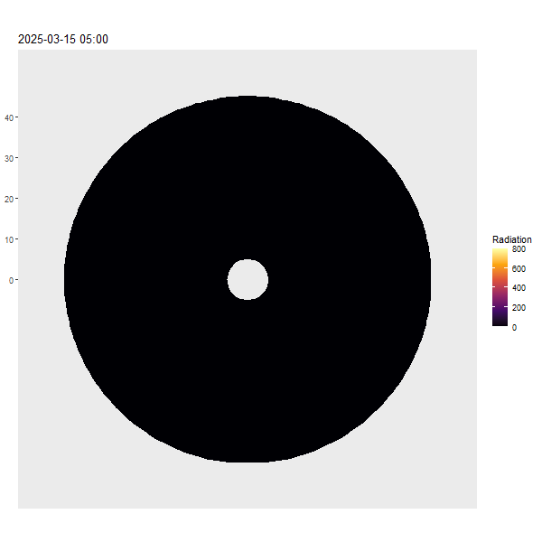

```{r setup, include=FALSE}
knitr::opts_chunk$set(echo = TRUE)
```

## Einleitung

Im Frühling oder auch im Hochwinter bei sehr warmen Verhältnissen liest man im Lawinenbulletin des SLF oft solche Sätze:

* "Im Tagesverlauf sind mittlere und vereinzelt grosse Nass- und Gleitschneelawinen zu erwarten."
* "Touren und Hüttenaufstiege sollten früh gestartet und rechtzeitig beendet werden."

Doch was ist darunter genau zu verstehen? Welche Expositionen sind zu welcher Jahreszeit und welcher Tageszeit bereits in der Planung zu vermeiden? Diese Fragen möchten die folgenden Zeilen erörtern.

Zuerst folgt eine Definition des Zustandes des Schnees, ab wann ein Hang als kritisch eingestuft wird. Danach einige Erkenntnisse zum täglichen und jahreszeitlichen Gang der Sonnenstrahlung in den Alpen. Dies wird kombiniert, um die relevanten Zeitpunkte der verschiedenen Expositionen im Jahresverlauf zu schätzen und ein Gefühl dafür zu entwickeln.

Einzelne Hänge können anhand einer Karte in der Planung beurteilt werden. Es gibt aber auch eine kleine App, mit der man die Strahlung auf einen Hang rechnen kann, die zusätzlich die Abschattung durch den Horizont berücksichtigt.

## Sun App

In dieser App kann der Sonnenverlauf und die Strahlungsmenge auf einen bestimmten Punkt in der Schweiz bestimmt werden. Dabei wird der Horizont berechnet um die Abschattung am Morgen und Abend zu bestimmen, sowie die Neigung und Exposition des Punktes für die Strahlungsberechnung berücksichtigt:
[Link zur App](https://luduel.shinyapps.io/sun_app/)

## Kritische Energiemenge

Die kritische Energiemenge, bis ein Hang instabil wird, wurde auf ungefähr $5 \; MJ/m^2$ berechnet. Folgende Annahmen für eine typische Frühlingssituation wurden getroffen:

* Anfangstemperatur Schnee: $-5 \; °C$
* Schneedichte: $400 \; kg/m^3$
* Schichtdicke: $10 \; cm$
* Albedo (Reflexion): $65 \; \%$
* kritischer Wasseranteil: $10 \; \%$

Es wird die Strahlungsenergie unter Berücksichtigung der Albedo berechnet, die nötig ist, um die obersten $10 \; cm$ Schnee bei gegebener Dichte um $5 \; °C$ zu erwärmen und dann $10 \; \%$ der Schneemasse zu schmelzen. Dieser Punkt dient als Orientierung für die folgenden Analysen.

Es ist wichtig im Hinterkopf zu behalten, dass dies Annahmen darstellen. Nach einer klaren Nacht mit guter Abstrahlung sollte dies einen vernünftigen Richtwert darstellen. Bei schlechter Abstrahlung und bewölktem Himmel, kann es natürlich schon viel schneller instabil werden oder gar nie stabil sein am Morgen.

Der wohl grösste Unsicherheitsfaktor mit einem grossen Einfluss ist die Albedo. Ist diese wesentlich grösser, weil beispielsweise wenige Zentimeter Neuschnee auf der sonst frühlingshaften Schneeoberfläche liegen, wird viel mehr Strahlung reflektiert und es kann wesentlich länger dauern, bis der Schnee nass wird. Liegt hingegen Saharastaub auf der Schneeoberfläche, kann sich die Albedo weiter verringern und die Hänge sind schon schneller instabil.

## Sonnenverlauf in den Alpen

Folgende Werte stellen eine grobe Orientierung dar:

* Im Januar scheint die Sonne 8h und überstreicht $115°$ von Südost bis Südwest. Im Zenit steht sie $22°$ über dem Horizont. Eine ebene Fläche erhält $3 \; MJ/m^2$ am Tag.
* Im Juni scheint die Sonne 16h und überstreicht $230°$ von Nordost bis Nordwest. Im Zenit steht sie $68°$ über dem Horizont. Eine ebene Fläche erhält $25 \; MJ/m^2$ am Tag.
* Wenn die Sonne stark auf einen Hang brennt, können gut $2$ bis $3 \; MJ/m^2$ pro Stunde eintreffen.

## Strahlung im Tagesverlauf

In der folgenden Animation sieht man den Tagesverlauf der Strahlung auf die verschiedenen Expositionen im März. Die vier Ringe stehen von innen nach aussen für 10, 20, 30 oder 40 Grad Neigung des Hanges. Man kann schön erkennen, wie die steilen Osthänge als erstes bestrahlt werden, danach die Südhänge und erst relativ spät dann auch die steilen Westhänge. Im Norden hat es auch um diese Jahreszeit noch sehr wenig Strahlung, insbesondere in den steilen Hängen.


```{r calculation, echo=FALSE, warning=FALSE}
# Load Packages
library(suncalc)
library(ggplot2)
library(data.table)

setwd("~/sun/sun_app")
source("inc_angle.R")
source("am_factor.R")
source("energy_needed.R")
source("deg_to_rad.R")
source("horizon.R")

setwd("~/sun")
source("plot_energieverlauf.R")

# Location Alpen Schweiz (Andermatt)
latitude <- 46.6
longitude <- 8.6

# Parameters
solarconstant <- 1000 # W/m2
emission <- 80 # W/m2
interval <- 10 # Minuten

# Time
time <- seq(
  from = as.POSIXct(paste("2025-01-01", "00:00:00"), tz = "Europe/Berlin"),
  to   = as.POSIXct(paste("2025-12-31", "23:59:59"), tz = "Europe/Berlin"),
  by   = paste(interval, "min")
)
time <- time[format(time, "%d") == "15"]

# hillside parameters
hillside <- expand.grid(aspect = seq(from = 180, to = -179.9, by = -45),
                        slope = seq(from = 0, to = 40, by = 10))
hillside <- subset(hillside, slope > 0 | aspect == 0)

# sunposition during day
sunposition <- getSunlightPosition(date = time, lat = latitude, lon = longitude)

# merge with hillside info
table <- merge(sunposition, hillside, by = NULL)
setDT(table)

# compute radiation
table[altitude > 0,
              radiation := inc_angle(altitude, azimuth, deg_to_rad(slope), deg_to_rad(aspect))
              * solarconstant
              * am_factor(altitude)]
table[, radiation := radiation - emission]
table[radiation < 0 | is.na(radiation), radiation := 0]
table[, cum_radiation_day_MJ := cumsum(radiation*interval*60/1000000), by = .(format(date, "%Y-%m-%d"), aspect, slope)]
```

## Strahlung im Jahresverlauf

Im Folgenden sind Grafiken für die Monate Januar bis Juni gezeigt für den Tagesverlauf der Gesamtenergie von 30 Grad steilen Hängen in den vier Hauptexpositionen. Die gestrichelte Linie steht als Referenz für eine ebene Fläche.

## Monate  {.tabset}

### Januar
```{r plot jan, echo=FALSE, warning=FALSE}
plot_energieverlauf(table, "2025-01-15", 30)
```

### Februar
```{r plot feb, echo=FALSE, warning=FALSE}
plot_energieverlauf(table, "2025-02-15", 30)
```

### März
```{r plot mar, echo=FALSE, warning=FALSE}
plot_energieverlauf(table, "2025-03-15", 30)
```

### April
```{r plot apr, echo=FALSE, warning=FALSE}
plot_energieverlauf(table, "2025-04-15", 30)
```

### Mai
```{r plot mai, echo=FALSE, warning=FALSE}
plot_energieverlauf(table, "2025-05-15", 30)
```

### Juni
```{r plot jun, echo=FALSE, warning=FALSE}
plot_energieverlauf(table, "2025-06-15", 30)
```

## Interpretation

Die Tabelle zeigt den Moment, an dem die Grenze von $5 \; MJ/m^2$ in der jeweiligen Exposition erreicht wird. Zwischen März und April hat es eine Stunde Zeitumstellung, die berücksichtigt ist.
```{r table, echo=FALSE}
daten <- data.frame(
  Monat = c("Jan", "Feb", "Mar", "Apr", "Mai", "Jun"),
  Ost = c(NA, "12:00", "10:30", "10:00", "09:30", "09:00"),
  Süd = c("12:30", "11:30", "11:00", "11:00", "11:00", "11:00"),
  West = c(NA, "15:00", "14:00", "14:00", "13:00", "13:00"),
  Nord = c(NA, NA, NA, "14:00", "12:00", "11:00")
)

knitr::kable(daten)
```

Diskussion der Kurve des Osthangs (rot) im April:

* Zwischen 9 und 11 Uhr verändert sich der Hang komplett. Die Energie steigt von $2 \; MJ/m^2$ auf $7 \; MJ/m^2$ in 2 Stunden.
* Um 9 Uhr ist er nach einer klaren Nacht noch kaum angesulzt und vermutlich pickelhart zu fahren.
* Um 10 Uhr ist er vermutlich angesulzt und grad noch sicher zu fahren.
* Um 11 Uhr ist er in den oberen Schichten schon komplett durchweicht und wird mit jeder Minute noch gefährlicher.

FAZIT: Das Zeitfenster, in welchem ein Hang bei optimalen Bedingungen und ohne Risiko gefahren werden kann, ist ziemlich kurz (ca. 1 Stunde). Wer um 12 Uhr im April in einem steilen Osthang rumgurkt, ist definitiv am falschen Ort.

Gedanken zu Tabelle und Grafiken:

* Die Energie steigt im Jahresverlauf stark an.
* Nordhänge haben am wenigsten Einstrahlung, Südhänge am meisten. Ost und West liegen dazwischen.
* Die Unterschiede zwischen Nord- und Südhängen sind im März / April am grössten.
* Tageszeitlich ist der Energieeintrag erst in den Ost- und Südhängen. Später auch in den Nord- und Westhängen.
* Im Januar hat einzig der Südhang relevanten Energieeintrag  von $10 \; MJ/m^2$.
* Im Februar hat der Südhang bereits $15 \; MJ/m^2$, Ost- und Westhang etwa die Hälfte. Der Ost- und Südhang erreichen die kritische Menge beide etwa am Mittag.
* Im März sieht der Nordhang erste Sonnenstrahlen, der Südhang hat bereits fast $20 \; MJ/m^2$. Der Osthang ist bereits ab 10:30 Uhr kritisch, der Südhang eine halbe Stunde später.
* Im April ist der Osthang bereits ab 10 Uhr, eine Stunde vor dem Südhang, über dem kritischen Wert.
* Im Mai hat auch der Nordhang eine ordentliche Menge von $15 \; MJ/m^2$ und erreicht um 12 Uhr die kritische Menge, nur eine Stunde nach dem Südhang. Der Osthang ist bereits ab 9:30 Uhr kritisch.
* Im Juni ändert sich nicht mehr viel. Interessant ist aber, dass der Nordhang zeitgleich mit dem Südhang die kritische Schwelle um 11 Uhr überschreitet.
